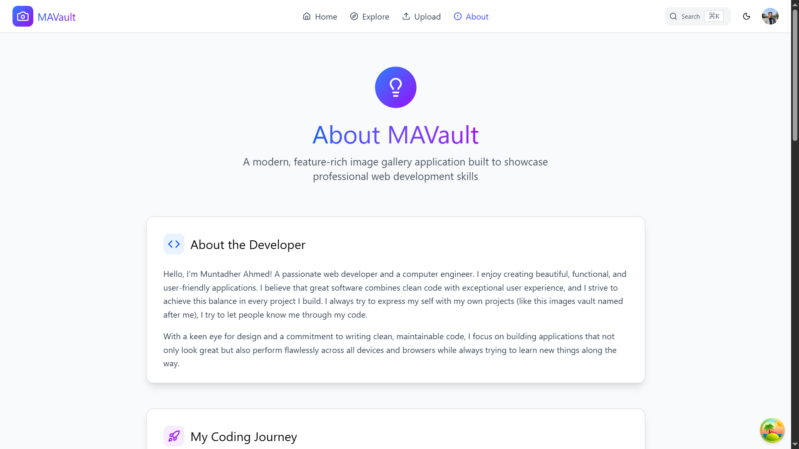
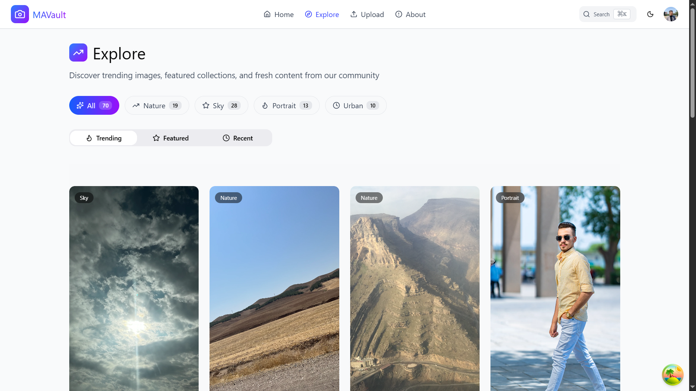
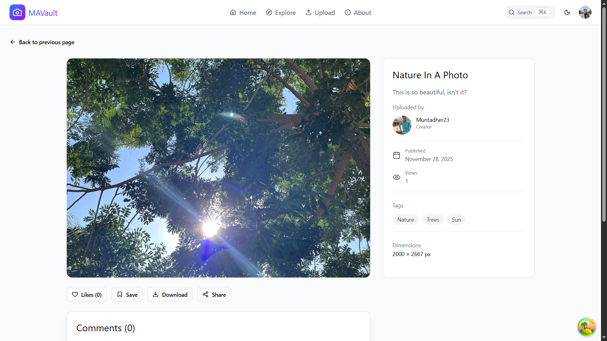
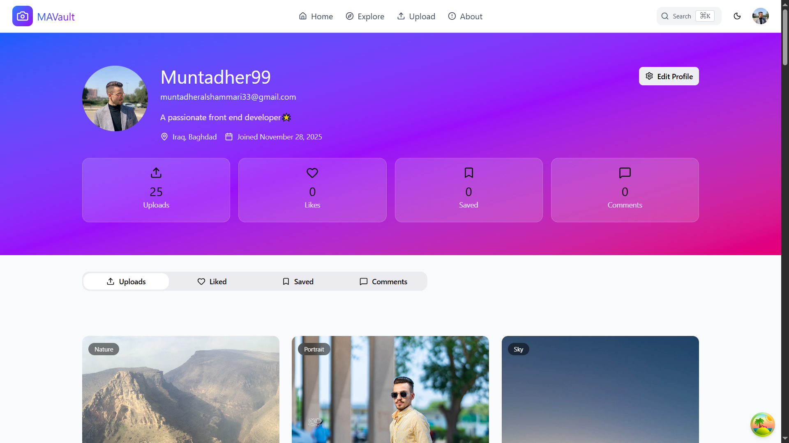
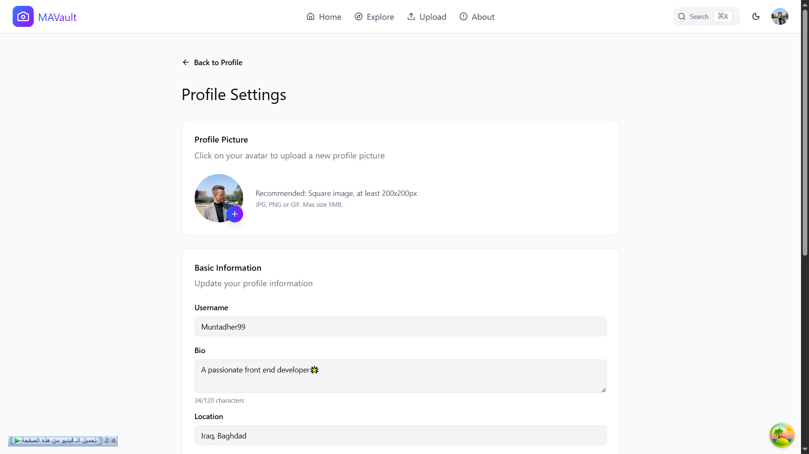
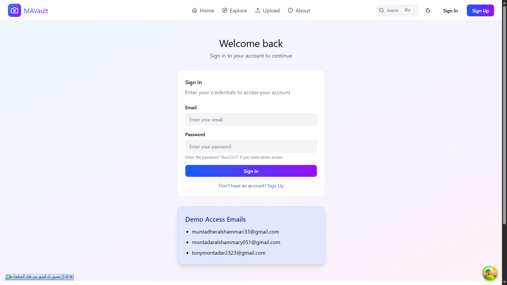
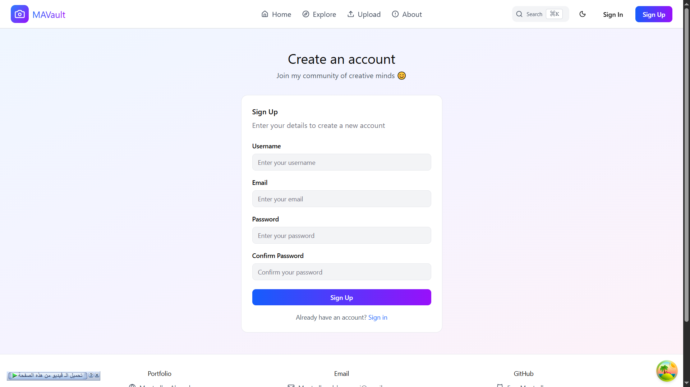
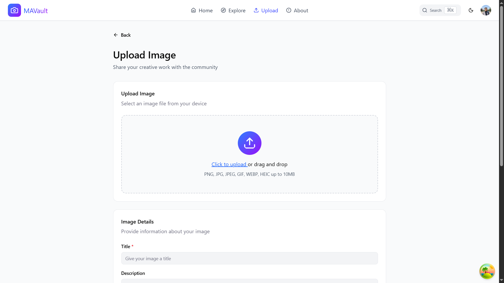

# MAVault

_Your personal vault to store, share, and explore inspiring images._

**Live Demo:** [ma-vault.vercel.app](https://ma-vault.vercel.app/)  
**Figma Design:** [MA-Vault Figma](https://www.figma.com/design/fN0jn4IeJC3jrNPjTNmX0M/MA-Vault?node-id=0-1&p=f&t=tPbmMjko7jwL7ptM-0)  
**YouTube Walkthrough:** [MA-Vault on YouTube](https://youtu.be/i7olw6nLtrA)

**MAVault** is a personal and social image gallery web app that brings together my passion for **photography** and **front-end development**.  
All the images on it are taken by me and uploaded to the app. It also allows users to share their photos, explore others’ work, and connect through comments, likes, and bookmarks — all in a beautifully responsive interface built with modern web technologies.

---

## Tech Stack

- **React**
- **TypeScript**
- **Tailwind CSS**
- **React Router**
- **React Query**
- **React Hot Toast**
- **Supabase**
- **React Dropzone**
- **Framer Motion**
- **React Virtual**
- **heic2any**
- **React Error Boundary**
- **Day.js**
- **Lucide Icons**

---

## Features

MAVault focuses on fast image loading/uploading, smooth interactions, and a delightful photography experience.

- Authentication & authorization system with Supabase
- A fully functional Upload, like, and comment system for authenticated users
- Smart upload system that supports HEIC, PNG, JPEG, JPG, and more — and converts all uploads to WebP format
- An upload system that compresses, resizes, and optimizes images on the fly
- User profile customization including user info and profile picture
- Image filtering, sorting, and search with pagination and Infinite scroll
- Performance-optimized Infinite Scroll powered by React Query, React Virtual, and more for the best UX
- A fully functional command palette with search, keyboard navigation and full-page navigation
- Framer Motion animations for all pages
- Dark mode support

---

## Pages

- **Home**
- **Explore**
- **About**
- **Upload**
- **User Profile**
- **Settings**
- **Single Image Page**
- **Sign Up / Sign In**

_All pages are fully responsive and optimized for common screen sizes._

---

## Screenshots

### Home


### About



### Explore



### Image Details



### Profile



### Settings



### Sign In



### Sign Up



### Upload



---

## Running Locally

To run this project locally, follow these steps:

```bash
# 1. Clone the repository and navigate into it
git clone https://github.com/Eng-Muntadher/MAVault.git
cd MAVault

# 2. Install dependencies
npm install      # or yarn install / pnpm install

# 3. Start the development server
npm run dev      # or yarn dev / pnpm dev

# 4. Open the app in your browser
# Default URL: http://localhost:5173/
```

---

## About the Project

This project is a personal image gallery built to merge my passion for **photography** — especially nature and lifestyle photography — with my passion for **front-end development**.  
It’s a space where I can display my own images and also allow users to create profiles, upload photos, and interact with others’ work through likes, bookmarks, and comments.

I designed this app to feel both personal and social — combining creativity, community, and customization.

---

## License

This project is licensed under the [MIT License](./LICENSE).
